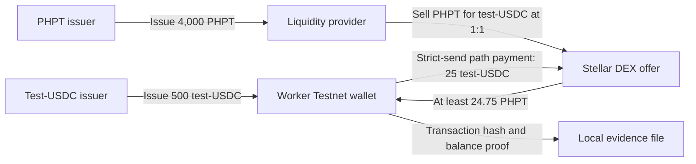

# Sweldo Instaward Week 1 Demo

This is the complete Week 1 scope only: create a controlled PHPT test asset, prepare a controlled test-USDC asset, seed a direct PHPT/USDC Stellar DEX offer, and prove a USDC-to-PHPT path payment on Stellar Testnet.

The assets have no real value. The asset named `USDC` is created solely for repeatable Testnet validation and is not Circle-issued USDC.

## Flow chart



## Run the complete demo

From the Sweldo project directory:

```bash
npm install
npm run week1:all
```

This command uses Stellar Testnet only. It does not deploy Sweldo, modify the production site, commit code, or push to GitHub.

## Run it step by step

### 1. Create the assets and liquidity

```bash
npm run week1:setup
```

The script:

1. Generates local Testnet-only accounts on the first run.
2. Funds one bootstrap account through Friendbot.
3. Creates PHPT issuer, test-USDC issuer, liquidity-provider, and worker accounts.
4. Adds the PHPT and test-USDC trustlines needed by the demo.
5. Issues 4,000 PHPT to the liquidity provider and 500 test-USDC to the worker.
6. Creates a direct Stellar DEX offer selling PHPT for test-USDC at 1:1.

Expected result: the terminal prints both asset issuers, the worker address, the open offer ID, and Stellar Expert links for every new setup transaction.

### 2. Execute the path payment

```bash
npm run week1:demo
```

The script asks Horizon for a viable strict-send route, allows 1% slippage, then sends 25 test-USDC from the worker and receives PHPT in the same worker account.

Expected balance result at the initial 1:1 offer price:

| Asset | Before | Change | After |
| --- | ---: | ---: | ---: |
| test-USDC | 500 | -25 | 475 |
| PHPT | 0 | +25 | 25 |

The terminal prints a public transaction URL. The exact balance result and transaction hash are also saved to `.sweldo-local/week1-result.json`.

### 3. Verify the evidence

```bash
npm run week1:verify
```

Expected result:

```text
PASS  transactionSuccessful
PASS  spentExpectedUSDC
PASS  receivedAtLeastMinimum
PASS  liquidityOfferStillOpen
```

Open the printed Stellar Expert transaction link and confirm that the operation type is `Path Payment Strict Send`, the source asset is the controlled test-USDC asset, and the destination asset is PHPT.

## Local files and safety

- `.sweldo-local/week1-testnet.json` contains the disposable Testnet secret keys.
- `.sweldo-local/week1-result.json` contains the public Week 1 evidence and latest verification result.
- `.sweldo-local/` is ignored by Git and must remain local.
- Re-running `npm run week1:setup` reuses the same local Testnet setup and only repairs missing balances or trustlines.
- Stellar Testnet can reset. If that happens, remove the local Week 1 state files and run the setup again.
