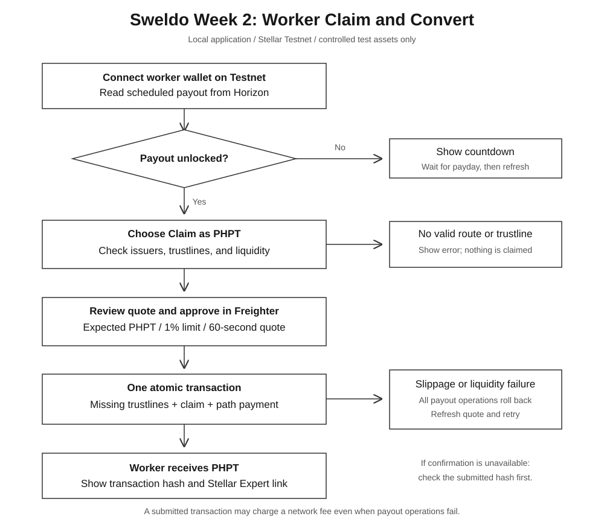
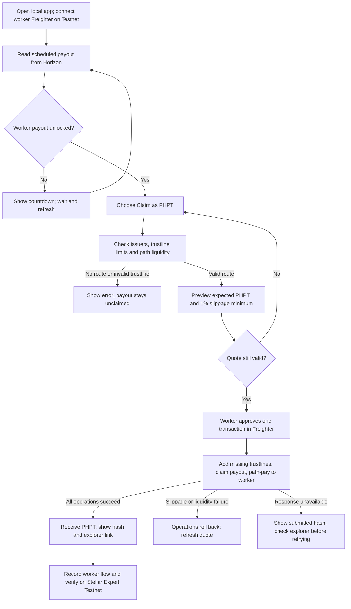

# Sweldo Instaward Week 2: Worker claim-and-convert

## Approved scope

The latest SOW assigns Week 2: "Integrate claim-and-convert into worker claim flow, including trustline handling, slippage/no-liquidity errors, and transaction-hash display."

Expected output: a worker claims a scheduled payout and receives PHPT through the claim/conversion flow, with a recording and transaction hash.

This change uses the existing Week 1 controlled test-USDC and PHPT assets and liquidity. Both assets have no real value; test-USDC is not Circle-issued USDC. Only the configured issuers are supported. Freighter signs the worker's transaction.

Week 3 dashboard reconstruction/CSV, Week 4 Wallets Kit/deployment, and new Soroban contracts are outside this change.

## Local work and Testnet evidence

The app runs on your computer. No command in this guide commits, pushes, or deploys code. Automated tests use fixtures and send no Stellar transactions.

A real Stellar Expert hash requires a Stellar Testnet transaction. The explicitly marked Testnet steps below do that when you run them. Local tests and simulated screenshots do not count as on-chain completion evidence.

## Flowchart



Editable Mermaid version:



One transaction contains `changeTrust` for each missing test-USDC/PHPT trustline, then `claimClaimableBalance`, then `pathPaymentStrictSend` to the same worker. All payout operations roll back if an operation fails. A submitted transaction may still charge a network fee. There is no automatic fallback claim after a failed conversion.

## 1. Run local checks

Use Node 22.18+ for the TypeScript test runner. From the project folder:

```bash
npm install
npm run week2:test
npm run lint
npm run build
```

Expected: all tests pass, lint has no new warnings, and the build completes. Vite may print its existing large-chunk advisory. Tests cover operation order, missing trustlines, issuer matching, locked payouts, no liquidity, expiry, changed wallet/payout, authorization/limits, slippage arithmetic, and errors.

## 2. Open the local worker UI

```bash
npm run week2:configure
npm run week2:dev
```

Open the URL printed by Vite, usually `http://127.0.0.1:5173`. Use the next printed port if it is occupied.

Configuration reads public issuer addresses from `.sweldo-local/week1-result.json` and writes ignored `.env.week2.local`. It sends no transactions and includes no secret keys. Your normal `.env.local` and production settings are untouched. Restart the server after changing the issuer configuration.

If Week 1 evidence is missing or Testnet was reset, restore the Week 1 setup first. Do not substitute unrelated issuers with the same asset codes.

## 3. Prepare a payout (Testnet transaction)

1. Switch Freighter to **Testnet** and select a separate worker wallet you control.
2. Fund the worker with Testnet XLM using Freighter's Testnet funding option/Friendbot. It needs XLM for up to two trustline reserves and fees.
3. Copy the worker's public `G...` address and replace the placeholder:

```bash
npm run week2:prepare -- --testnet --worker YOUR_WORKER_PUBLIC_ADDRESS --delay 60
```

The command uses the disposable Week 1 worker as the demo employer, locks **25 test-USDC** for your Freighter worker, and schedules its unlock 60 seconds ahead. The demo funding key stays in the ignored local Week 1 state file and is never served to the browser. No contract is changed.

Expected output: worker/employer public addresses, balance ID, unlock time, funding hash, and Stellar Expert link. These public details are saved to `.sweldo-local/week2-payout.json`.

Each run creates a new 25 test-USDC payout. Do not rerun just to refresh the page. Missing liquidity or depleted demo funds require restoring the Week 1 setup.

## 4. Claim in the browser (Testnet transaction)

1. Choose **For employees** and connect the same worker in Freighter.
2. Find **25 USDC** in the timeline. Before payday, it shows **LOCKED** and a countdown.
3. After payday, allow a ledger to close, then select **Claim as PHPT**.
4. Review the quote. At the Week 1 1:1 offer:

| Field | Expected |
| --- | --- |
| Payout | 25 test-USDC |
| Expected receipt | 25 PHPT |
| Minimum receipt | 24.75 PHPT |
| Slippage limit | 1% |
| Quote lifetime | 60 seconds |
| Trustlines | Missing USDC/PHPT listed, or "Trustlines ready" |

5. Select **Claim and convert** and approve in Freighter before expiry. Missing trustlines are included in the same transaction.
6. Expect **Payout claimed as PHPT**, the amount, full hash, copy button, and **Verify on Stellar Expert**. The payout disappears from the active list.
7. Open the explorer receipt and confirm `Claim Claimable Balance` followed by `Path Payment Strict Send`. Any needed `Change Trust` operations appear first.

At an unchanged 1:1 price:

| Item | Before | After |
| --- | --- | --- |
| Scheduled payout | 25 test-USDC claimable | Claimed |
| Worker test-USDC balance | B | B: claimed and converted together |
| Worker PHPT balance | P | P + 25 PHPT |
| Worker XLM | Existing Testnet balance | Fee deducted; additional reserve committed for new trustlines |

Actual PHPT may differ from the preview when liquidity changes. The reviewed minimum stays fixed. For a 25 PHPT quote, receiving less than 24.75 PHPT fails the transaction.

## 5. Verify the real receipt

Use the successful claim-and-convert hash from the UI, not the Week 1 conversion hash or the Week 2 funding hash:

```bash
npm run week2:verify -- YOUR_CLAIM_AND_CONVERT_TRANSACTION_HASH
```

Expected:

```text
PASS  successful
PASS  scheduledPayoutClaimed
PASS  convertedInSameTransaction
PASS  receivedPHPT
```

The read-only verifier binds the claim and conversion to your prepared payout, worker, and issuers. Public results go to `.sweldo-local/week2-result.json`.

## Failure checks

| Check | How | Expected |
| --- | --- | --- |
| Missing trustlines | Use a fresh funded worker | Missing lines shown; added with approval |
| Quote expiry | Wait over 60 seconds in the preview | Confirm disables; refresh available |
| Rejected signature | Cancel Freighter approval | Nothing submitted; payout remains |
| Wrong network | Switch Freighter after opening preview | Signing stops with a Testnet message |
| Changed wallet | Switch Freighter account before approval | Signing stops; reconnect intended worker |
| No liquidity | Automated local no-route test | No signing; clear liquidity message |
| Slippage | Automated local `op_under_dest_min` test | Error explains 1% limit and asks to refresh |
| Low reserve | Automated local `op_low_reserve` test | Error asks for Testnet XLM |
| Uncertain submission | Local browser test interrupts response | Submitted hash displayed for verification |

Controlled local fixtures test no-liquidity/slippage UI behavior without changing shared Testnet offers. They are QA evidence, not on-chain receipts.

## Recording script (2-3 minutes)

1. Show the local URL and Freighter Testnet account: "Week 2 connects our conversion setup to a worker's scheduled payout."
2. Show the prepared payout and funding hash: "This 25 test-USDC payout unlocks at payday."
3. Show the PHPT quote, minimum, and trustlines: "The worker reviews the conversion before approving it."
4. Approve in Freighter: "Trustline setup, claim, and conversion are submitted together." Do not record secret keys or recovery phrases.
5. Show the success receipt and PHPT wallet balance: "The worker received PHPT, with the transaction hash here."
6. Show explorer claim/path-payment operations and the four verifier PASS lines.

For a separate failure clip, let a fresh payout's quote expire. Label any simulated recording clearly; it does not replace the real Testnet recording.

## Evidence still needed after local QA

- [ ] Real worker claim-and-convert video.
- [ ] Funding hash and successful claim-and-convert hash.
- [ ] PHPT receipt and explorer operation screenshots.
- [ ] `.sweldo-local/week2-result.json` reports `passed: true`.

Leave these unchecked until the real Testnet run is complete.

## References

- [Claimable balances](https://developers.stellar.org/docs/build/guides/transactions/claimable-balances)
- [Path payments](https://developers.stellar.org/docs/build/guides/transactions/path-payments)
- [Strict-send error codes](https://developers.stellar.org/docs/data/apis/horizon/api-reference/errors/result-codes/operation-specific/path-payment-strict-send)
