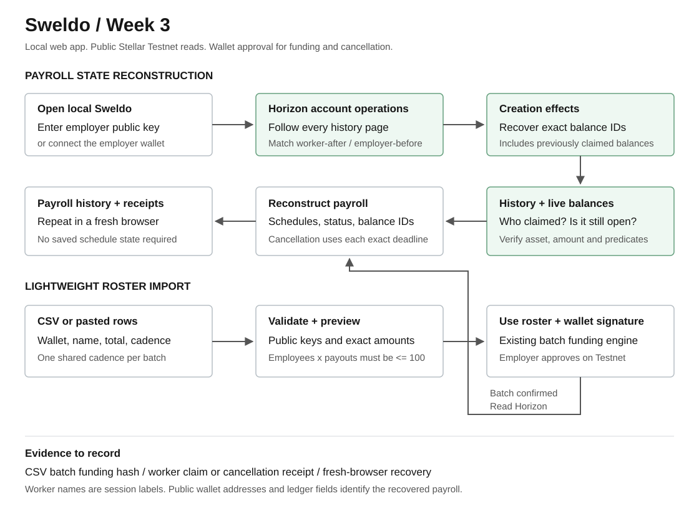
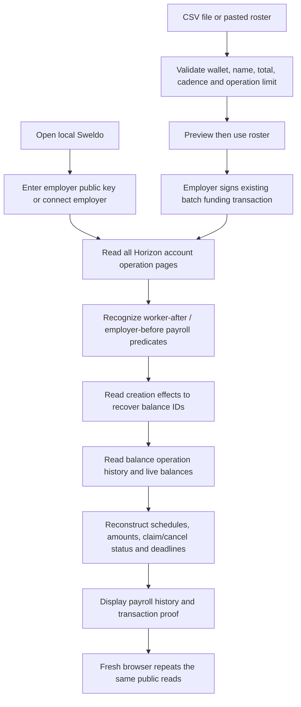

# Week 3: Ledger/Horizon Payroll State Reconstruction

## Scope and expected output

The SOW's Week 3 task is:

> Implement Ledger/Horizon Payroll State Reconstruction and add lightweight CSV/paste import for roster scheduling.

Expected output:

> Fresh browser session recovers payroll schedules, claim status, balance IDs, and cancellation eligibility from Horizon/ledger data; CSV import creates a batch schedule.

This implementation updates the React web app locally. It adds no new contract, wallet integration, deployment, or mobile feature. The funding, claiming, cancellation and Week 2 conversion engines remain the existing Stellar Testnet flows.





## 1. Start from the beginning

Use Node 22.18 or newer for the local TypeScript test and inspect commands.

1. Open Terminal in the project directory:

   ```bash
   cd "/Users/heinric/Documents/Stellar Hackathon"
   npm install
   npm run week3:test
   npm run week3:dev
   ```

2. Keep that Terminal running. Vite prints the local address, normally `http://127.0.0.1:5173/`. If it selects another port, use the printed address throughout this guide.
3. Open that address in a browser. Close the first-visit guide with Escape if it opens.
4. Click **Pay your team**. The direct address is `http://127.0.0.1:5173/#/employer`.

Result: the employer screen shows the **Who are you paying?** step, **Import roster**, and **Payroll history**. Creating payroll proceeds through Team, Schedule, and Review and lock.

`week3:dev` binds the app to this computer's loopback interface. Horizon reads and wallet-signed demo transactions still use the public Stellar Testnet; this is not an offline ledger. No GitHub push or Vercel deployment is needed.

## 2. Recover an existing payroll without connecting a wallet

This check is read-only and needs no secret key or wallet approval.

1. In **Payroll history**, paste the employer's public G... key into **Employer public key**.
2. Click **Load payroll**.
3. Wait until **Checked** appears.
4. Inspect the worker address, total amount, payout count, individual balance IDs, payday times, and payout status.
5. Open the arrow beside the schedule to inspect the funding transaction on Stellar Expert. Open **Balance**, **Claim**, or **Cancellation** for the corresponding proof.

For an existing local Week 2 fixture on Testnet, use this public employer address:

```text
GA63TYUUORN4FLT2QWWUVL37ERXZ5OTCEQWCIRO3PR3PYB6JUUYKGLH4
```

At the October 7, 2026 read-only check, this recovered one 25 test-USDC payout for worker `GB5OYIHNYJKUP6VFZHYCPLFHBF63SWIDZAPBXET4NKEFLEPWPMKIETPL`, with funding hash `b4e6660bada04f9517759f8c4d38aca928394f9cde2f22799a488fad2be588ab`. Its observed status was **Claimable**. It can change if someone claims it, and Testnet resets or retained-history limits can remove old evidence.

You can run the same reconstruction in a separate Terminal:

```bash
npm run week3:inspect -- GA63TYUUORN4FLT2QWWUVL37ERXZ5OTCEQWCIRO3PR3PYB6JUUYKGLH4
```

Result: the command prints recovered schedules, balance IDs, statuses, and transaction links. It only reads Horizon.

## 3. Prove fresh-browser recovery

1. Copy the employer public key used in section 2.
2. Open a new incognito/private window or a different browser.
3. Open the same local URL and click **Pay your team**.
4. Paste the employer key into **Employer public key** and click **Load payroll**.
5. Compare the funding hash, worker wallet, total, payout count, balance IDs, and statuses with the original window.

Result: the ledger fields match without copying localStorage. The dashboard does not read `sweldo-schedules-v1` at all.

Worker names are optional session labels. Because the current funding transactions do not write names to the ledger, a fresh session shows **Team member** plus the exact worker wallet. Names, draft form values and optional Soroban proof labels are not part of the recovered ledger state. The funded schedule, balance IDs, deadlines and receipts are recovered independently.

## 4. Import a roster and create a small batch in the UI

Use two worker accounts you control for this demo. Select Testnet in Freighter and fund the employer and worker accounts with free Testnet XLM if needed.

1. In **Pay your team**, click **Connect wallet** and choose **Freighter extension**. Approve your employer account on Testnet.
2. Under **Who are you paying?**, click **Import roster**.
3. Paste this CSV, replacing both wallet values with your two worker public keys:

   ```csv
   wallet,name,amount,cadence
   YOUR_FIRST_WORKER_PUBLIC_KEY,Ana Santos,6,minute
   YOUR_SECOND_WORKER_PUBLIC_KEY,Marco Reyes,9,minute
   ```

   Alternatively, edit `docs/week-3-roster-example.csv` and choose it with **Choose CSV**. The supplied addresses are public examples; replace them with wallets you control before funding.

4. Click **Preview roster**. Verify the two worker addresses, names, totals and minute cadence.
5. Click **Use roster**. The dialog closes and the employer form contains those two rows.
6. Click **Continue to schedule**, then select **Live demo**. Confirm **3 times**, **every minute**, **starting in 1 minute**.
7. Click **Continue to review**. Confirm **2 employees x 3 payouts** and **15 XLM** total in the configured payroll asset. Week 3 can be demonstrated with XLM; no PHPT liquidity is required for this state-reconstruction milestone.
8. Click **Lock payroll on Stellar**. Approve the funding transaction in your wallet. If your existing configuration enables the Soroban registry, its existing extra proof transaction may request another approval.
9. Save the payroll funding transaction hash shown in the success notice/proof. Click the dashboard refresh icon if Horizon has not indexed it yet.

Expected result with XLM:

| Worker | Total | Payouts | Each payout |
| --- | --- | --- | --- |
| Ana | 6 XLM | 3 | 2 XLM |
| Marco | 9 XLM | 3 | 3 XLM |

One batch funding transaction creates six claimable balances. Payroll history reconstructs two worker schedules with the same funding hash and three distinct balance IDs per worker. Before each deadline, the status is **Scheduled**.

Amounts in the import are total payroll amounts, not amounts per payout. Keep one cadence across the roster because the existing batch form shares one pay schedule. CSV and tab-separated spreadsheet paste are supported. Amounts must split exactly across the chosen payout count. Duplicate wallets, invalid keys, missing columns, unsupported cadences, files over 100 KB, and batches over 100 operations are rejected before the form changes.

## 5. Observe a worker claim and employer cancellation

1. Keep the employer public key and funding hash available.
2. Wait for Ana's first payday, then switch Freighter to Ana's Testnet account, disconnect/reconnect Sweldo, and open **My pay**.
3. Claim one unlocked payout through the existing worker flow. Save its claim hash.
4. Open **Pay your team**, paste the employer public key in **Payroll history**, and click **Load payroll**.
5. The claimed payout shows **Claimed**, its balance ID remains visible in history, and its **Claim** link opens the receipt. Any other unlocked, unclaimed payout shows **Claimable**.
6. To test cancellation, reconnect the employer while at least one deadline is still in the future. If the minute demo has already elapsed, create another batch and choose **starting in 3 minutes** before funding it.
7. Click **Cancel remaining payroll**, confirm the eligible payout count, and approve the Testnet transaction.
8. Refresh Payroll history, including in a fresh private window using the employer public key.

Result: future payouts claimed by the employer show **Cancelled** with cancellation hashes. Payouts already claimed by the worker remain **Claimed**. Unclaimed payouts at or past payday remain **Claimable** and cannot be cancelled. Cancellation eligibility is recomputed from live balances and exact deadlines immediately before signing, then enforced by Stellar's predicates.

## 6. Negative checks

| Action | Expected result |
| --- | --- |
| Load an invalid employer key | Public-key validation error; no Horizon query |
| Load a funded employer with no supported payroll | Empty payroll message |
| Disconnect the wallet and inspect another employer | Public history loads; signing requires the matching employer |
| Paste an invalid worker key | Row-specific error; existing roster stays intact |
| Mix minute and week cadences | Import rejected; use separate batches |
| Import 3 workers with 50 payouts each | Rejected as 150 operations |
| Import amount 1 split into 3 payouts | Rejected to prevent rounding loss |
| Stop access to Horizon and refresh | Error; cancellation is unavailable until verification succeeds |
| A balance is missing without a verified claim operation | **Unverified**, never automatically **Claimed** |
| Inspect a payroll after all deadlines | No future cancellation allowed |

## 7. What to record

1. Show the local address, **Pay your team**, and the Testnet indicator.
2. Say: "Week 3 adds payroll state reconstruction from Horizon and a lightweight roster import."
3. Show CSV/paste input, preview, two imported worker rows, and the six-payout batch summary.
4. Record wallet approval of the Testnet funding transaction and its Stellar Expert hash.
5. Show the reconstructed schedule entries, balance IDs and payday status.
6. Show a worker claim and its receipt, then reload the employer history to show **Claimed**.
7. Show a future cancellation and its receipt, if included in your recording.
8. Open a fresh private window, paste only the employer public key, and recover the same ledger fields.
9. Say: "The payroll state comes from public ledger history. Names are session labels, so the wallet address identifies the worker in a fresh browser."

Keep the funding hash, claim/cancellation hashes, local screenshots and your actual screen recording as evidence. Automated fixtures are development checks and must not be submitted as real user or on-chain evidence.

## Architecture and limits

- Account operations are paginated to discover supported employer-funded payroll creation operations.
- Creation effects provide exact claimable balance IDs, including balances that were later claimed.
- Balance operation history distinguishes worker claims from employer returns using the successful operation's claimant.
- Open balances are read again to verify amounts, asset and the two mutually exclusive predicates.
- Grouping uses funding transaction, worker address and exact asset identity. No browser-stored schedule fields determine ledger state.
- This recognizes the existing Sweldo payroll predicate pattern, not an exclusive app identifier; matching schedules created outside Sweldo can also appear.
- Horizon must retain the relevant history. A Testnet reset/pruning cannot be recovered from localStorage and is reported honestly.
- Unknown or failed reads do not invent claim/cancellation evidence. Requests are bounded, abort when switching employers, and large histories fail explicitly rather than silently truncating.

Primary references: [Horizon create-claimable-balance operations](https://developers.stellar.org/docs/data/apis/horizon/api-reference/resources/operations/object/create-claimable-balance), [Horizon claim operations](https://developers.stellar.org/docs/data/apis/horizon/api-reference/resources/operations/object/claim-claimable-balance), and [claimable balance resources](https://developers.stellar.org/docs/data/apis/horizon/api-reference/resources/claimablebalances).

## Local verification performed

On October 7, 2026:

- The 12 Week 3 tests passed, covering reconstruction, pagination, claim/cancellation classification, unknown status, cancellation deadlines and roster validation.
- The existing 19 Week 2 tests passed.
- The web production build passed. Lint completed with the repository's existing Fast Refresh warnings.
- A read-only live Horizon check recovered the existing 25 test-USDC Week 2 payout in both the CLI and a browser without schedule storage.
- Playwright checked desktop and 390px mobile layouts, paste import/preview/application, invalid roster rejection, transaction links and a Horizon failure.
- A local simulated wallet/Horizon run confirmed that the imported two-worker roster generated six funding operations: three payouts of 2 and three payouts of 3. The dashboard then reconstructed the two schedules.

No new Testnet transaction was submitted during these checks. The simulated wallet run is a development test, not a real receipt. Complete sections 4-7 with your own Testnet wallets to obtain the actual batch hash and screen recording for submission.
