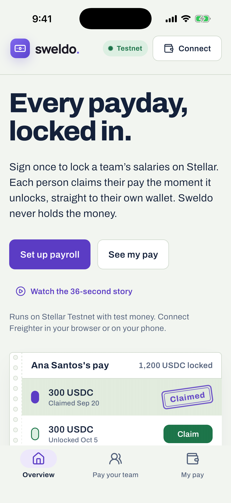
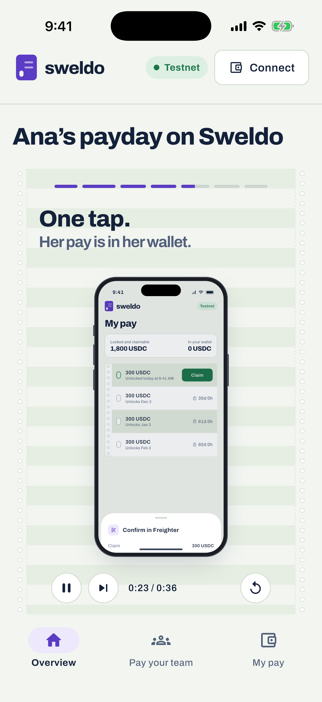

# Sweldo — Flutter app

The Flutter edition of Sweldo: non-custodial payroll on Stellar Testnet for web, iOS and Android.
It matches the React app feature for feature, uses BLoC for state, and connects to **Freighter**
through the browser extension (web) and the Freighter mobile app (iOS/Android, over WalletConnect).

<p>
  
  
  
</p>

▶ [`docs/media/sweldo-story-iphone.mp4`](docs/media/sweldo-story-iphone.mp4): the 36-second in-app story, recorded on an iPhone 17 Pro simulator.

## What it does

| Feature | React app | Flutter app |
| --- | --- | --- |
| Connect Freighter, show XLM balance, wrong-network warning | ✓ | ✓ (extension on web, Freighter app on phones) |
| Batch payroll: many employees × up to 50 payouts in **one** transaction | ✓ | ✓ |
| Mutually exclusive employee / employer time predicates | ✓ | ✓ |
| Soroban Payroll Registry proof (`record_schedule`) | ✓ | ✓ |
| Recent schedules on this device (`sweldo-schedules-v1`, same JSON) | ✓ | ✓ |
| Cancel future payouts, re-checked on the ledger before signing | ✓ | ✓ |
| Friendbot funding and one-tap trustline | ✓ | ✓ |
| Employee timeline with live countdowns and claim | ✓ | ✓ |
| Claim history merged from Horizon and this device | ✓ | ✓ |
| Claim-and-convert USDC → PHPT (quote, 1% slippage, 60 s expiry, atomic tx, uncertain-submission guard) | ✓ | ✓ |
| Story mode: a 36-second explainer told on an iPhone | — | ✓ |
| Interactive "How a payroll runs" with a 3D iPhone | — | ✓ |
| Shuffle: fill the payroll form with random sample values | ✓ | ✓ |
| Smart pay schedule: editable sentence, drag-to-set payout track, presets, live insights | ✓ | ✓ |

## Run it

Requirements: Flutter 3.41+ (Dart 3.11+). Configuration is passed with `--dart-define-from-file`:

| File | Use |
| --- | --- |
| `config/testnet.json` | XLM payroll and the deployed Soroban registry. Works with no setup. |
| `config/week2.json` | Test-USDC payroll with USDC → PHPT claim-and-convert (Week 2 issuers). |

```bash
flutter pub get
```

```bash
flutter run -d chrome --dart-define-from-file=config/testnet.json
```

```bash
flutter run -d ios --dart-define-from-file=config/week2.json
```

Keys in the config files:

| Key | Purpose |
| --- | --- |
| `SWELDO_ASSET_CODE` / `SWELDO_ASSET_ISSUER` | Issued payroll asset. Leave blank for XLM. |
| `SWELDO_PHPT_ISSUER` | Enables claim-and-convert for the configured test-USDC issuer. |
| `SWELDO_REGISTRY_CONTRACT_ID` | Soroban Payroll Registry contract. Blank skips registry proofs. |
| `WALLETCONNECT_PROJECT_ID` | Turns on pairing with the Freighter mobile app. Get one at [dashboard.reown.com](https://dashboard.reown.com). Keep it in a `config/*.local.json` file (git-ignored). |

Presentation mode opens straight into the story and plays it, which is useful for pitches and
screen recordings:

```bash
flutter run -d ios --dart-define-from-file=config/week2.json --dart-define=SWELDO_STORY_DEMO=true
```

Tests (amount math, claim predicates, cancellation rules, batch transaction building, the payroll
form BLoC, and a layout sweep over every quarter second of the story):

```bash
flutter test
```

## Freighter compatibility

**Web: Freighter browser extension.** `web/index.html` loads the official
`@stellar/freighter-api` 6.0.1 bundle (vendored in `web/vendor`, Apache-2.0) before Flutter
starts. `FreighterExtensionConnector` calls it through `dart:js_interop` and uses the same steps as
the React app's `connectWallet`: detect with retries, `requestAccess`, fall back to
`setAllowed` + `getAddress`, read the network, then `signTransaction` with the Testnet
passphrase.

**iOS / Android: Freighter mobile app.** `FreighterMobileConnector` pairs over WalletConnect v2
(Reown Sign) on the `stellar:testnet` chain and signs with `stellar_signXDR`
(`{xdr}` → `{signedXDR}`), the method Freighter Mobile implements. On a phone it opens
`freighterwallet://wc?uri=…` (in the native app and in phone browsers); on desktop it shows a QR
code to scan with the app. Freighter returns
to `sweldo://`, which only brings the app forward (Flutter's automatic deep-link routing is
switched off so a wallet hand-off never changes the page).

Keys never enter Sweldo. Every transaction is built in the app, signed in Freighter, then submitted
to Horizon.

## Guide

A highlighting guide (`features/tour/`) dims the app, spotlights one control at a time and explains
it, moving between the overview, employer and pay pages. Spotlighted controls stay usable. It opens
on a first visit and from **Guide** in the top bar; → / ← move, Esc closes. Mark anything new with
`TourTarget(id: …)` and add a `TourStep` for it in `tour_steps.dart`.

## Architecture

Feature-first folders. Each feature owns its `domain` (pure models and rules), `data`
(repositories over Horizon, Soroban RPC, local storage and the wallet), `bloc`, and `view`.

```
lib/
  main.dart                      startup: config, storage, dependencies
  app/
    app.dart                     repository + bloc providers, MaterialApp.router
    dependencies.dart            builds every long-lived object once
    router/app_router.dart       go_router shell, fade-through page transitions
    shell/                       top bar, bottom nav, network warning, page frame
  core/
    config/                      dart-define configuration
    stellar/                     Horizon client, network constants, signer interface
    error/                       typed failures → plain-language messages
    storage/                     JSON over SharedPreferences (localStorage on web)
    theme/                       colour, type and motion tokens; ThemeData
    utils/                       stroop-exact amounts, formatting
    widgets/                     buttons, notices, payroll paper, stamps, punch slots
  features/
    wallet/                      Freighter extension + Freighter mobile connectors, WalletBloc
    account/                     Friendbot funding and trustlines (AccountSetupCubit)
    payroll/                     employer: PayrollFormBloc, SchedulesBloc, registry
    payouts/                     employee: PayoutsBloc, timeline, claim history
    conversion/                  claim-and-convert: ConversionBloc, quote sheet
    home/                        overview and the interactive pay card
    story/                       the explainer film: script, stage, iPhone frame, player
```

State: `WalletBloc` owns the session; `PayrollFormBloc`, `SchedulesBloc` and `PayoutsBloc` sit
above the router so tab switches keep their state, and they follow the wallet through
`WalletRepository.sessions`. `ConversionBloc` lives only as long as its sheet.

## Design

Built with Anthropic's `frontend-design` skill (installed as the `frontend-design` Claude Code
plugin), whose job is to avoid generic, templated UI. The direction comes from Filipino payday paperwork:

- **Brand.** The original Sweldo mark: a Lucide banknote on a violet gradient tile, with the
  "sweldo." wordmark in Manrope ExtraBold. It is also the iOS, Android and web app icon.
- **Icons.** Lucide throughout, the same set the React app uses, mapped by meaning in
  `core/theme/sw_icons.dart`.
- **Payroll paper.** Greenbar banding and tractor-feed edges mark anything that *is* a pay
  schedule. Violet stamp ink for actions and the "Claimed" stamp; payday green for pay you can
  claim now. Archivo for the interface, IBM Plex Mono only for keys and hashes.
- **Responsive like Tailwind.** `context.responsive(base, sm:, md:, lg:, xl:)` and
  `context.up(Breakpoint.md)` use Tailwind's breakpoints (640/768/1024/1280), mobile first.
- **Interaction states.** `Interactive` gives every control Tailwind-style
  `hover:-translate-y`, tinted hover shadows, `active:scale`, and `focus-visible` rings (keyboard
  Enter/Space activate). Live signals use `animate-ping` (`PingDot`); loading uses `animate-pulse`
  (`Skeleton`).
- **3D, where it means something.** The process explorer's iPhone has real depth layers, a ground
  shadow and pointer tilt, and swings to present each step. The hero pay card and the wallet tile
  tilt toward the pointer with a moving glare. Six payouts sit in a 3D pile that spreads into its
  paydays on hover or tap. A claimed payout turns over like a split-flap board to its stamped
  receipt.
- **Smart pay schedule.** "Pay *every week*, *6 times*, starting *in 1 week*." Each part is a
  menu (including "Pay until a date…" and "On a date…"). A 50-slot track sets the payout count by
  drag, tap or arrow keys, locking slots beyond the team's one-transaction limit. Presets fill all
  three at once, and live insights show the first and last payday, transaction capacity (with
  "Fit to one transaction"), whether the connected wallet covers the total plus reserves, and
  notes like monthly drift.
- **Reduced motion** is respected everywhere: tilts flatten, flips swap instantly, and the story
  steps through still frames.

## Notes

- Testnet only. Test-USDC and PHPT have no real value.
- If the project sits in an iCloud-synced folder (such as `~/Documents`), iOS builds can fail
  codesigning with "resource fork, Finder information, or similar detritus not allowed". Build
  from a folder outside iCloud, or run `xattr -cr build` and retry.
- `flutter build web` targets JavaScript. A Wasm build is blocked by JS-interop checks inside the
  Stellar SDK's optional smart-account module.
